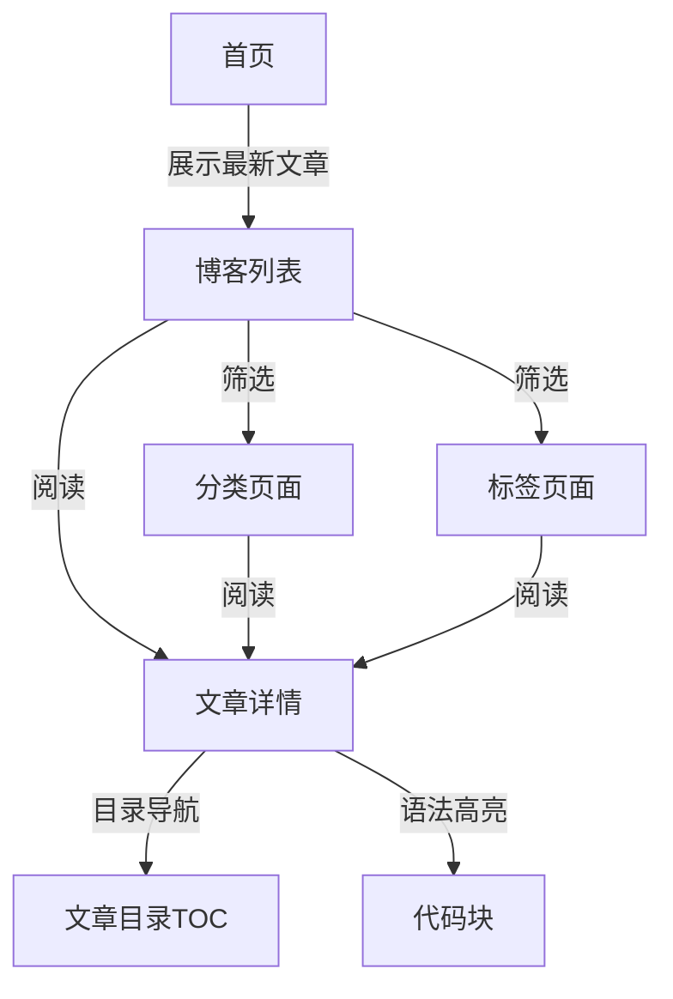
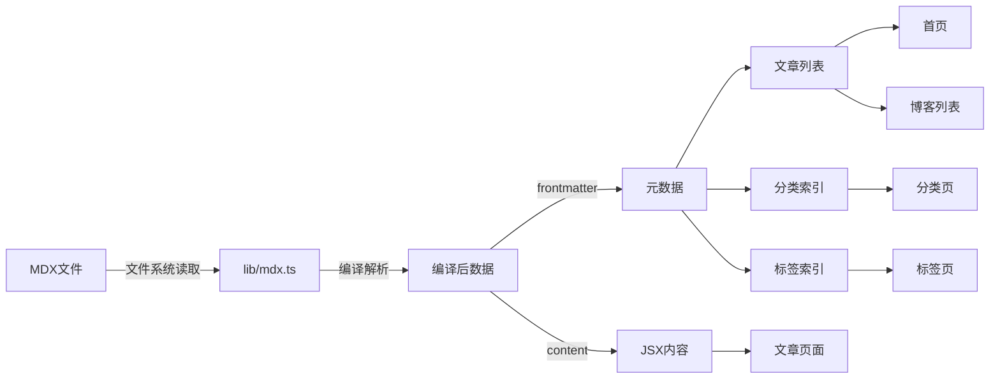

# 技术博客产品功能与开发计划

## 产品功能概述

### 核心价值定位

构建一个面向开发者的高性能、极简主义个人技术博客平台，采用"Docs as Code"理念，提供优秀的代码阅读体验和内容组织能力。

### 目标用户

- 技术开发者（阅读者）
- 内容创作者（博主本人）

### 核心功能模块



## 详细功能规格

### 1. 内容展示层

#### 1.1 首页 ([app/page.tsx](app/page.tsx))

- 展示最新博客文章列表（卡片式布局）
- 每篇文章显示：标题、摘要、发布日期、阅读时间、分类、标签
- 简洁的 Hero 区域（名称 + 一句话介绍）
- 响应式设计（移动端优先）

#### 1.2 博客列表页 (new: `app/blog/page.tsx`)

- 完整文章列表（分页或无限滚动）
- 侧边栏筛选：按分类、按标签
- 排序选项：最新、最旧
- 搜索框（客户端筛选，未来可扩展）

#### 1.3 文章详情页 ([app/blog/[slug]/page.tsx](app/blog/[slug]/page.tsx))

**现有功能：**

- 基础 MDX 渲染
- Frontmatter 元数据显示

**新增功能：**

- 文章目录（Table of Contents）- 侧边栏固定，自动高亮当前阅读位置
- 代码语法高亮（使用 rehype-pretty-code 或 Shiki）
- 阅读时间估算
- 文章元信息栏：发布日期、更新日期、分类、标签、字数统计
- 文章底部导航：上一篇/下一篇
- 相关文章推荐（基于标签/分类匹配）
- 优化的 Typography（已有 @tailwindcss/typography）

#### 1.4 分类页面 (new: `app/categories/[category]/page.tsx`)

- 显示特定分类下的所有文章
- 分类描述（可选，从配置读取）
- 文章列表（同博客列表样式）

#### 1.5 标签页面 (new: `app/tags/[tag]/page.tsx`)

- 显示特定标签下的所有文章
- 标签云展示（所有标签，按使用频率调整大小）
- 文章列表

### 2. 内容管理层

#### 2.1 MDX 内容处理 ([lib/mdx.ts](lib/mdx.ts))

**现有功能：**

- `getPostBySlug`: 获取单篇文章
- `getAllPosts`: 获取所有文章

**扩展功能：**

- `getPostsByCategory`: 按分类获取文章
- `getPostsByTag`: 按标签获取文章
- `getAllCategories`: 获取所有分类及文章数
- `getAllTags`: 获取所有标签及使用次数
- `getRelatedPosts`: 获取相关文章
- 计算阅读时间
- 提取文章目录（heading 解析）

#### 2.2 Frontmatter 扩展

```yaml
---
title: '文章标题'
date: '2026-01-08'
updated: '2026-01-08' # 新增
description: '文章摘要'
published: true
category: '前端开发' # 新增（单个分类）
tags: ['React', 'Next.js', 'TypeScript'] # 新增（多个标签）
cover: '/images/cover.jpg' # 新增（可选封面图）
---
```

### 3. UI 组件层

#### 3.1 布局组件

- **Header** (new: `components/layout/header.tsx`)
- Logo/站点名称
- 导航链接：首页、博客、分类、标签
- 主题切换按钮（已有 ThemeSwitch）
- 移动端响应式菜单
- **Footer** (new: `components/layout/footer.tsx`)
- 版权信息
- 社交链接（GitHub, Twitter, Email 等）
- RSS 订阅链接
- 站点统计（可选）

#### 3.2 博客相关组件

- **PostCard** (new: `components/blog/post-card.tsx`)
- 文章卡片（首页/列表页使用）
- **TableOfContents** (new: `components/blog/table-of-contents.tsx`)
- 文章目录侧边栏
- 滚动自动高亮
- **PostMeta** (new: `components/blog/post-meta.tsx`)
- 文章元信息展示
- **CategoryBadge / TagBadge** (new: `components/blog/badges.tsx`)
- 分类和标签徽章
- **CodeBlock** (via MDX components)
- 语法高亮代码块
- 复制按钮
- 文件名显示（可选）

#### 3.3 通用组件（基于 shadcn/ui）

已有：Button, Card, Input, Label新增可能需要：Badge, Separator, ScrollArea, Sheet（移动端菜单）

### 4. SEO 优化

#### 4.1 元数据优化 ([app/layout.tsx](app/layout.tsx) & 各页面)

- 动态生成页面标题、描述
- Open Graph 标签
- Twitter Card 标签
- 结构化数据（JSON-LD for Article）

#### 4.2 站点地图与 RSS

- `app/sitemap.ts`: 生成 sitemap.xml
- `app/feed.xml/route.ts`: 生成 RSS feed

#### 4.3 性能优化

- 图片优化（Next.js Image 组件）
- 静态生成（generateStaticParams）
- 代码分割（动态导入客户端组件）

## 技术实现架构

### 数据流



### 目录结构扩展

```javascript
app/
├── blog/
│   ├── page.tsx (新增：博客列表页)
│   └── [slug]/
│       └── page.tsx (增强：文章详情)
├── categories/
│   ├── page.tsx (新增：分类总览)
│   └── [category]/
│       └── page.tsx (新增：分类详情)
├── tags/
│   ├── page.tsx (新增：标签总览)
│   └── [tag]/
│       └── page.tsx (新增：标签详情)
├── sitemap.ts (新增：站点地图)
├── feed.xml/
│   └── route.ts (新增：RSS)
└── layout.tsx (增强：全局元数据)

components/
├── layout/
│   ├── header.tsx (新增)
│   ├── footer.tsx (新增)
│   └── mobile-nav.tsx (新增)
├── blog/
│   ├── post-card.tsx (新增)
│   ├── post-meta.tsx (新增)
│   ├── table-of-contents.tsx (新增)
│   ├── badges.tsx (新增)
│   └── code-block.tsx (新增)
└── mdx-components.tsx (增强)

lib/
├── mdx.ts (扩展功能)
├── reading-time.ts (新增：阅读时间)
├── toc.ts (新增：目录提取)
└── seo.ts (新增：SEO 工具)

content/
└── posts/
    └── *.mdx (内容文件)
```

## 开发阶段规划

### Phase 1: 核心布局与导航（优先级：高）

**目标**: 建立完整的页面框架和导航体系**任务列表**:

1. 创建 Header 组件（Logo、导航、主题切换）
2. 创建 Footer 组件
3. 创建移动端响应式导航菜单
4. 更新 `app/layout.tsx` 集成 Header/Footer
5. 优化全局样式和响应式布局

**涉及文件**:

- `components/layout/header.tsx` (new)
- `components/layout/footer.tsx` (new)
- `components/layout/mobile-nav.tsx` (new)
- `app/layout.tsx` (update)

---

### Phase 2: 内容组织系统（优先级：高）

**目标**: 实现分类和标签功能，扩展 MDX 处理能力**任务列表**:

1. 扩展 Frontmatter 类型定义（添加 category, tags, updated 等字段）
2. 实现 `getPostsByCategory` 函数
3. 实现 `getPostsByTag` 函数
4. 实现 `getAllCategories` 和 `getAllTags` 函数
5. 创建分类总览页 `app/categories/page.tsx`
6. 创建分类详情页 `app/categories/[category]/page.tsx`
7. 创建标签总览页 `app/tags/page.tsx`
8. 创建标签详情页 `app/tags/[tag]/page.tsx`

**涉及文件**:

- `lib/mdx.ts` (major update)
- `app/categories/page.tsx` (new)
- `app/categories/[category]/page.tsx` (new)
- `app/tags/page.tsx` (new)
- `app/tags/[tag]/page.tsx` (new)

---

### Phase 3: 首页与博客列表（优先级：高）

**目标**: 重构首页展示最新文章，创建完整博客列表页**任务列表**:

1. 创建 PostCard 组件
2. 创建 CategoryBadge 和 TagBadge 组件
3. 实现阅读时间估算功能 (`lib/reading-time.ts`)
4. 重构首页展示文章列表
5. 创建博客列表页 `app/blog/page.tsx`

**涉及文件**:

- `components/blog/post-card.tsx` (new)
- `components/blog/badges.tsx` (new)
- `lib/reading-time.ts` (new)
- `app/page.tsx` (major update)
- `app/blog/page.tsx` (new)

---

### Phase 4: 文章详情页增强（优先级：高）

**目标**: 添加目录、代码高亮、文章导航等高级功能**任务列表**:

1. 配置代码语法高亮（rehype-pretty-code 或 Shiki）
2. 实现目录提取功能 (`lib/toc.ts`)
3. 创建 TableOfContents 组件（侧边栏 + 滚动高亮）
4. 创建 PostMeta 组件（显示完整元信息）
5. 创建 CodeBlock 组件（带复制按钮）
6. 实现上一篇/下一篇导航
7. 实现相关文章推荐（基于标签匹配）
8. 更新 `components/mdx-components.tsx` 注册自定义组件

**涉及文件**:

- `lib/toc.ts` (new)
- `components/blog/table-of-contents.tsx` (new)
- `components/blog/post-meta.tsx` (new)
- `components/blog/code-block.tsx` (new)
- `components/mdx-components.tsx` (update)
- `app/blog/[slug]/page.tsx` (major update)

---

### Phase 5: SEO 优化（优先级：中）

**目标**: 完善 SEO，提升搜索引擎可见性**任务列表**:

1. 创建 SEO 工具函数 (`lib/seo.ts`)
2. 为各页面添加动态 `metadata` 导出
3. 添加 Open Graph 和 Twitter Card
4. 实现 sitemap.xml (`app/sitemap.ts`)
5. 实现 RSS feed (`app/feed.xml/route.ts`)
6. 添加结构化数据（JSON-LD）

**涉及文件**:

- `lib/seo.ts` (new)
- `app/sitemap.ts` (new)
- `app/feed.xml/route.ts` (new)
- `app/blog/[slug]/page.tsx` (add metadata)
- `app/categories/[category]/page.tsx` (add metadata)
- `app/tags/[tag]/page.tsx` (add metadata)

---

### Phase 6: 性能优化与测试（优先级：中）

**目标**: 确保生产环境性能和用户体验**任务列表**:

1. 实现 `generateStaticParams` 预生成所有文章页面
2. 优化图片加载（Next.js Image）
3. 客户端组件按需加载（动态 import）
4. 测试深色模式兼容性
5. 移动端适配测试
6. 性能审计（Lighthouse）

**涉及文件**:

- `app/blog/[slug]/page.tsx` (add generateStaticParams)
- `app/categories/[category]/page.tsx` (add generateStaticParams)
- `app/tags/[tag]/page.tsx` (add generateStaticParams)

---

## 技术栈确认

- **框架**: Next.js 16 (App Router)
- **语言**: TypeScript
- **样式**: Tailwind CSS 4 + @tailwindcss/typography
- **UI 组件**: shadcn/ui (Radix UI)
- **图标**: Lucide React
- **MDX**: next-mdx-remote
- **主题**: next-themes
- **动画**: Motion (framer-motion 新版)
- **代码高亮**: 待选择（rehype-pretty-code 或 Shiki）
- **包管理**: pnpm

## 设计原则

1. **极简主义**: 去除冗余元素，聚焦内容
2. **可访问性**: WCAG 2.1 AA 标准
3. **性能优先**: 静态生成、代码分割、懒加载
4. **响应式**: 移动优先设计
5. **开发者友好**: 语法高亮、复制按钮、目录导航
6. **类型安全**: 严格的 TypeScript 类型定义
