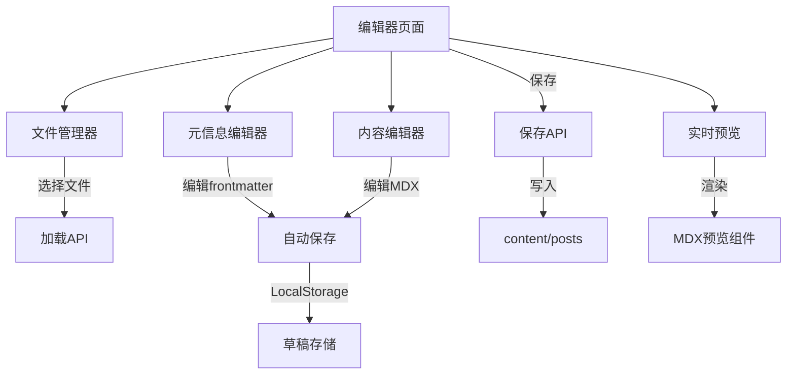

# 在线编辑器与功能套件开发计划

## 第一阶段：在线 Markdown 编辑器（优先实施）

### 功能概述

实现一个功能完整的在线 MDX 编辑器，支持：

- 分屏实时预览
- Frontmatter 可视化编辑
- 草稿自动保存
- 文件列表管理
- 快捷键支持

**预计时间**：6-8 小时---

### 架构设计



---

### 实现细节

#### 1. 编辑器主页面

**路径**：[`app/admin/editor/page.tsx`](app/admin/editor/page.tsx)**布局**：

```javascript
┌────────────────────────────────────────────┐
│ 📝 文章编辑器                    [保存] [发布] │
├──────────┬─────────────────────────────────┤
│ 文件列表  │ ┌───────────────────────────┐   │
│          │ │ 元信息编辑（折叠面板）      │   │
│ + 新建   │ │ - 标题                     │   │
│          │ │ - 日期                     │   │
│ 文章1    │ │ - 分类/标签               │   │
│ 文章2    │ └───────────────────────────┘   │
│ 文章3    │                                 │
│          │ ┌───────────────┬────────────┐  │
│          │ │  MDX 编辑器    │ 实时预览    │  │
│          │ │               │            │  │
│          │ │               │            │  │
│          │ │               │            │  │
│          │ └───────────────┴────────────┘  │
└──────────┴─────────────────────────────────┘
```

**技术选型**：

- 编辑器：`@monaco-editor/react` 或 `react-simple-code-editor`
- 预览：复用现有 MDX 渲染组件
- 状态管理：React Context + useState

---

#### 2. API 路由

##### 2.1 获取文件列表

**路径**：[`app/api/admin/posts/route.ts`](app/api/admin/posts/route.ts)

```typescript
GET /api/admin/posts
Response:
{
  "posts": [
    {
      "slug": "welcome-to-ningblog",
      "title": "欢迎来到 NingBlog",
      "updatedAt": "2026-01-08",
      "published": true
    }
  ]
}
```

**实现**：

- 读取 `content/posts` 目录
- 解析每个 MDX 文件的 frontmatter
- 返回文件列表

---

##### 2.2 获取单个文章内容

**路径**：[`app/api/admin/posts/[slug]/route.ts`](app/api/admin/posts/[slug]/route.ts)

```typescript
GET /api/admin/posts/{slug}
Response:
{
  "slug": "welcome-to-ningblog",
  "content": "---\ntitle: ...\n---\n\n# 内容...",
  "frontmatter": {
    "title": "欢迎来到 NingBlog",
    "date": "2026-01-08",
    "category": "前端开发",
    "tags": ["Next.js", "React"]
  }
}
```

---

##### 2.3 保存/更新文章

**路径**：[`app/api/admin/posts/[slug]/route.ts`](app/api/admin/posts/[slug]/route.ts)

```typescript
PUT /api/admin/posts/{slug}
Request:
{
  "frontmatter": { ... },
  "content": "# 文章内容..."
}
Response:
{
  "success": true,
  "message": "保存成功"
}
```

**实现**：

- 验证 JWT Token（复用现有认证）
- 合并 frontmatter 和 content
- 写入 `content/posts/{slug}.mdx`

---

##### 2.4 创建新文章

**路径**：[`app/api/admin/posts/route.ts`](app/api/admin/posts/route.ts)

```typescript
POST /api/admin/posts
Request:
{
  "title": "新文章标题"
}
Response:
{
  "slug": "new-post-2026-01-12",
  "message": "创建成功"
}
```

**实现**：

- 根据标题生成 slug
- 创建带默认 frontmatter 的 MDX 文件

---

##### 2.5 删除文章

```typescript
DELETE /api/admin/posts/{slug}
Response:
{
  "success": true,
  "message": "删除成功"
}
```

---

#### 3. 核心组件

##### 3.1 文件管理器

**组件**：[`components/admin/file-manager.tsx`](components/admin/file-manager.tsx)**功能**：

- 显示所有文章列表
- 点击切换当前编辑文章
- 新建文章按钮
- 删除文章确认

**状态**：

```typescript
{
  posts: Post[]
  currentSlug: string | null
  loading: boolean
}
```

---

##### 3.2 元信息编辑器

**组件**：[`components/admin/meta-editor.tsx`](components/admin/meta-editor.tsx)**功能**：

- 可折叠面板
- 表单字段：
- 标题（必填）
- 日期（日期选择器）
- 描述（textarea）
- 分类（下拉选择 + 新建）
- 标签（多选 + 新建）
- 发布状态（开关）

**UI**：

```typescript
<Accordion>
  <AccordionItem value="meta">
    <AccordionTrigger>文章元信息</AccordionTrigger>
    <AccordionContent>
      <Input label="标题" />
      <DatePicker label="发布日期" />
      <Select label="分类" />
      <TagInput label="标签" />
      <Switch label="发布" />
    </AccordionContent>
  </AccordionItem>
</Accordion>
```

---

##### 3.3 MDX 编辑器

**组件**：[`components/admin/mdx-editor.tsx`](components/admin/mdx-editor.tsx)**技术选型**：**方案 A**：Monaco Editor（推荐）

```typescript
import Editor from '@monaco-editor/react'

<Editor
  height="600px"
  defaultLanguage="markdown"
  value={content}
  onChange={handleChange}
  theme={theme === 'dark' ? 'vs-dark' : 'vs-light'}
  options={{
    minimap: { enabled: false },
    fontSize: 14,
    wordWrap: 'on'
  }}
/>
```

**方案 B**：轻量级（如果不想引入 Monaco）

```typescript
import { useState } from 'react'

<textarea
  value={content}
  onChange={(e) => setContent(e.target.value)}
  className="w-full h-full font-mono"
  spellCheck={false}
/>
```

**快捷键**：

- `Cmd/Ctrl + S`：保存
- `Cmd/Ctrl + B`：加粗
- `Cmd/Ctrl + I`：斜体
- `Cmd/Ctrl + K`：插入链接

---

##### 3.4 实时预览

**组件**：[`components/admin/mdx-preview.tsx`](components/admin/mdx-preview.tsx)**实现**：

```typescript
import { MDXRemote } from 'next-mdx-remote/rsc'
import { mdxComponents } from '@/components/mdx-components'

export function MDXPreview({ content }: { content: string }) {
  return (
    <div className="prose dark:prose-invert">
      <MDXRemote source={content} components={mdxComponents} />
    </div>
  )
}
```

**注意**：

- 捕获渲染错误
- 显示错误提示
- 滚动同步（可选）

---

#### 4. 草稿自动保存

**实现**：[`lib/draft-storage.ts`](lib/draft-storage.ts)

```typescript
// LocalStorage 存储草稿
export const draftStorage = {
  save(slug: string, data: { frontmatter: any; content: string }) {
    localStorage.setItem(
      `draft:${slug}`,
      JSON.stringify({
        ...data,
        savedAt: new Date().toISOString(),
      })
    )
  },

  load(slug: string) {
    const draft = localStorage.getItem(`draft:${slug}`)
    return draft ? JSON.parse(draft) : null
  },

  remove(slug: string) {
    localStorage.removeItem(`draft:${slug}`)
  },
}
```

**自动保存**：

```typescript
// 每 30 秒自动保存
useEffect(() => {
  const timer = setInterval(() => {
    if (isDirty) {
      draftStorage.save(slug, { frontmatter, content })
    }
  }, 30000)

  return () => clearInterval(timer)
}, [slug, frontmatter, content, isDirty])
```

---

#### 5. 权限保护

**中间件**：复用现有的 JWT 验证

```typescript
// app/admin/editor/page.tsx
import { verifyAuth } from '@/lib/auth'

export default async function EditorPage() {
  await verifyAuth() // 如果未登录，重定向到登录页

  return <Editor />
}
```

---

### 文件清单

#### 新建文件

```javascript
app/
├── admin/
│   └── editor/
│       └── page.tsx                    # 编辑器主页面
├── api/
│   └── admin/
│       └── posts/
│           ├── route.ts                # 获取列表、创建文章
│           └── [slug]/
│               └── route.ts            # 获取、保存、删除单篇文章

components/
├── admin/
│   ├── file-manager.tsx                # 文件管理器
│   ├── meta-editor.tsx                 # 元信息编辑器
│   ├── mdx-editor.tsx                  # MDX 编辑器
│   └── mdx-preview.tsx                 # 实时预览

lib/
└── draft-storage.ts                    # 草稿存储工具
```

#### 需要安装的依赖

```bash
pnpm add @monaco-editor/react
# 或
pnpm add react-simple-code-editor prismjs
```

---

### 实施步骤

#### Phase 1：基础框架（2小时）

1. 创建编辑器页面路由
2. 实现文件列表 API
3. 创建基础布局（文件列表 + 编辑区）

#### Phase 2：编辑功能（2小时）

1. 集成 Monaco Editor
2. 实现元信息编辑表单
3. 实现保存 API

#### Phase 3：预览与草稿（2小时）

1. 实现实时预览
2. 添加草稿自动保存
3. 错误处理和提示

#### Phase 4：完善功能（1-2小时）

1. 新建文章功能
2. 删除文章功能
3. 快捷键支持
4. UI 优化和测试

---

## 第二阶段：系列文章功能（后续实施）

### 功能概述

支持创建文章系列，实现系列导航。**预计时间**：4-5 小时

### 实现要点

1. **数据模型**：

```yaml
# frontmatter 新增字段
series: 'React 18 完全指南'
seriesOrder: 2
```

2. **系列页面**：`/series/[slug]`
3. **系列导航组件**：文章页显示上一篇/下一篇（同系列）
4. **自动生成系列目录**

---

## 第三阶段：图片管理系统（后续实施）

### 功能概述

实现图片上传、管理、自动优化。**预计时间**：5-7 小时

### 实现要点

1. **图片上传**：拖拽上传 + 粘贴上传
2. **存储方案**：

- 本地：`public/uploads/`
- 云存储：Vercel Blob 或 Cloudinary

3. **自动优化**：

- 格式转换（WebP）
- 压缩
- 生成缩略图

4. **图片库**：浏览、搜索、删除

---

## 第四阶段：主题定制系统（后续实施）

### 功能概述

提供多种配色方案和布局选项。**预计时间**：4-6 小时

### 实现要点

1. **配色方案**：

- 默认（当前）
- 蓝色调
- 绿色调
- 紫色调

2. **字体设置**：

- 字体大小（S/M/L）
- 字体族（Sans/Serif/Mono）

3. **布局选项**：

- 宽度（窄/中/宽）
- 侧边栏位置（左/右）

**存储**：LocalStorage---

## 技术考虑

### 性能优化

- 编辑器使用代码分割，按需加载
- 预览防抖（500ms）
- 文件列表虚拟滚动（如果文章很多）

### 安全性

- 所有 API 都需要 JWT 验证
- 文件路径验证，防止目录遍历
- 内容 XSS 过滤

### 用户体验

- 未保存提示（离开页面前）
- 保存成功 Toast
- 加载状态反馈
- 错误提示友好

---

## 总结

**优先级**：

1. ✅ 在线编辑器（立即实施）
2. 📅 系列文章（第二优先）
3. 📅 图片管理（第三优先）
4. 📅 主题定制（第四优先）

**总预计时间**：

- 第一阶段：6-8 小时
